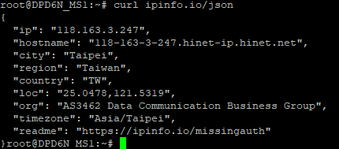

# 使用 MQTT 和 Crontab 定期透過腳本(Python)將硬體資訊上傳至雲端儲存

## 前言

由於公司的多功能底座產品所匹配使用的網路硬碟產品停產了，為了不透過網路硬碟產品取得底座上的資料，我需要使用 MQTT 並建立排成腳本(crontab)定期發送裝置相關訊息透過 MQTT 協議至與底座綁定的雲端伺服器。

### 設定編譯環境

為了要執行 MQTT 的終端機指令，則需要將 Mosquitto 的終端機工具編譯至 Firmware 中，可於/SDK 根目錄下使用已下指令開啟 Linux 核心配置的設定檔，將 Mosquitto Enable。

```
$ make menuconfig
```

> 此指令其實是修改根目錄下的.config 檔內的文字，透過有 GUI 的形式，比較方便使用

### 腳本撰寫

由於整套系統使用 influxDB 作為資料庫，使用 Telegraf 將 MQTT 蒐集到的資料轉存至資料庫中，因此 MQTT 所傳送的訊息須符合 influxDB 的語法規範

```
[資料表名稱],[Tag1,Tag2,....] [Field1,Field2,....]
```

> 由於 InfluxDB 的資料庫特性，無需自行建立資料表與其中的`Tag`和`Field`，指需要透過語法規範直接將數據發送至伺服器，DB 會自動建立對應的資料表與內容，並將收到的資料作儲存

為了使資料可被過濾，每筆資料都需要夾帶部分固定的`Tag`用於分辨不同的裝置，例如:透過單機版網頁設定的`Office`、`Department`和`MacAddress`等資訊。

```python
def get_msg_formate(tableName):
    db_table_init()
    User_Info = os.popen(
        'sqlite3 /home/database.db \'select * from MQTTInfo\'').readlines()[0].replace("\n", "").split("|")
    mac = os.popen(
        'cat /etc/config/network  | awk -F \"\'\" \'NR==15 {print $2}\'').readlines()[0].replace("\n", "")
    msg_formate = tableName + ',Office=' + \
        User_Info[1] + ',Department=' + User_Info[2] + ',Mac=' + mac
    return msg_formate

#初始化資料庫
def db_table_init():
    os.popen('sqlite3 /home/database.db \'CREATE TABLE IF NOT EXISTS MQTTInfo ("Server_IP" nvarchar(50) NOT NULL COLLATE NOCASE,"Office" nvarchar(50) NOT NULL COLLATE NOCASE,"Department" nvarchar(50) COLLATE NOCASE,"MQTTEnable" bit DEFAULT 0,PRIMARY KEY("Server_IP"));\'')
    count = os.popen(
        'sqlite3 /home/database.db \'select count(*) from MQTTInfo\'').readlines()[0].replace("\n", "")
    if int(count) < 1:
        os.popen('sqlite3 /home/database.db \'INSERT INTO MQTTInfo (Server_IP,Office,Department,MQTTEnable) VALUES ("0.0.0.0","Headquarter","R&D",0)\'')
```

後續的腳本依照需求，基本上都是使用終端機指令取得機器狀態的字串，再透過字串處裡將目標的狀態字串整理成`InfluxDB`所使用的語法規範，最後透過終端機指令發送 MQTT 訊息至伺服器。

```python
#發送MQTT訊息
def send_mqtt_event(msg):
    server_ip = os.popen(
        'sqlite3 /home/database.db \'select Server_IP from MQTTInfo\'').readlines()[0].replace("\n", "")
    cmd = '/usr/bin/mosquitto_pub -h ' + \
        server_ip + ' -t "topic/Nas" -m "' + msg + '"'
    cmd = cmd.encode('utf-8')
    os.popen(cmd)
    print(cmd)

#發送裝置的資訊
def send_docking_info():
    name = os.popen(
        'cat /etc/config/system |grep hostname |  awk \'{print $3}\'').readlines()[0].replace("\n", "")
    version = os.popen('cat /home/fw').readlines()[0].replace("\n", "")
    updateStatus = os.popen(
        'cat /etc/mosquitto/var/updateStatus').readlines()[0].replace("\n", "")
    ip = ""
    mask = ""
    gateway = ""
    isStaticIP = os.popen(
        'cat /etc/config/network  | awk \'NR==10 {print $3}\'').readlines()[0].replace("\n", "")
    if "static" in isStaticIP:
        isStaticIP = "true"
        mask = os.popen(
            'cat /etc/config/network  | awk -F \"\'\" \'NR==12 {print $2}\'').readlines()[0].replace("\n", "")
        ip = os.popen(
            'cat /etc/config/network  | awk -F \"\'\" \'NR==11 {print $2}\'').readlines()[0].replace("\n", "")
        gateway = os.popen(
            'cat /etc/config/network  | awk -F \"\'\" \'NR==13 {print $2}\'').readlines()[0].replace("\n", "")
    else:
        isStaticIP = "false"
        mask = os.popen(
            'ifconfig | awk -F\'[:]\'  \'NR==2 {print $3}\' | awk \'{print $1}\'').readlines()[0].replace("\n", "")
        ip = os.popen(
            'ifconfig | awk -F\'[:]\'  \'NR==2 {print $2}\' | awk \'{print $1}\'').readlines()[0].replace("\n", "")
        gateway = os.popen(
            'ifconfig | awk -F\'[:]\'  \'NR==2 {print $4}\'').readlines()[0].replace("\n", "")

    if "true" in updateStatus:
        version = "Updating"
    msg = get_msg_formate('Docking') + ',IP=' + ip + \
        ',Name=' + name
    msg = msg + ' Mask=\\"' + mask + '\\",Version=\\"' + version + \
        '\\",GateWay=\\"' + gateway + '\\",Static_Ip=\\"' + isStaticIP + '\\"'
    send_mqtt_event(msg)
```

比較特殊的功能是透過目前裝置的對外 IP 取得目裝置所在經緯度，此功能是透過`ipinfo.io`的免費網路服務將對外 IP 轉換為經緯度，如下圖，由於是免費服務，其轉匯的精確度指到小數點後第四位，無法精準定位，但網路上還有其他的付費服務可將經緯度定位至小數點後 10 位以上的。



```python
#取得裝置的地理位置
def send_device_location_info():
    location = os.popen(
        'sqlite3 /home/database.db \'select * from UserLocation\'').readlines()[0].replace("\n", "").split("|")
    res = os.popen('curl ipinfo.io/json').read().replace("\n", "")
    data = json.loads(res, strict=False)
    if float(location[0]) < 0:
        location = data["loc"].split(",")
    msg = get_msg_formate('Docking_Location')
    msg = msg + ' City=\\"' + data["city"] + '\\",Region=\\"' + data["region"] + '\\",Country=\\"' + \
        data["country"] + '\\",Timezone=\\"' + data["timezone"] + \
        '\\",Lat=' + location[0] + ',Lon=' + location[1]
    send_mqtt_event(msg)
```

### 排程設置(Crontab)

透過 crontab 可設定固定時間間隔要執行的程式腳本，crontab 的設置指令如下

```bash
#編輯
$ crontab -e

#查看列表
$ crontab -l
```

測試時，可直接透過 SSH 連線至裝置上，透過上述指令編輯 crontab 的排程列表，並查看是否設置完成，如下圖。


測試完成後，為了將 Crontab 的設定包裝至 Image 檔內，需要針對

### FW 打包
