Fastlane使用教學
====

Fastlane簡介
----
Fastlane是一個使用Ruby語言所撰寫的Terminal tool，可以透過撰寫字定義的「lane」(腳本)來達成建置、測試、簽署、發布、上架、來源控制(Soure Control)等常使用在Terminal的指令，下圖為官網中 **吹噓的優點**。

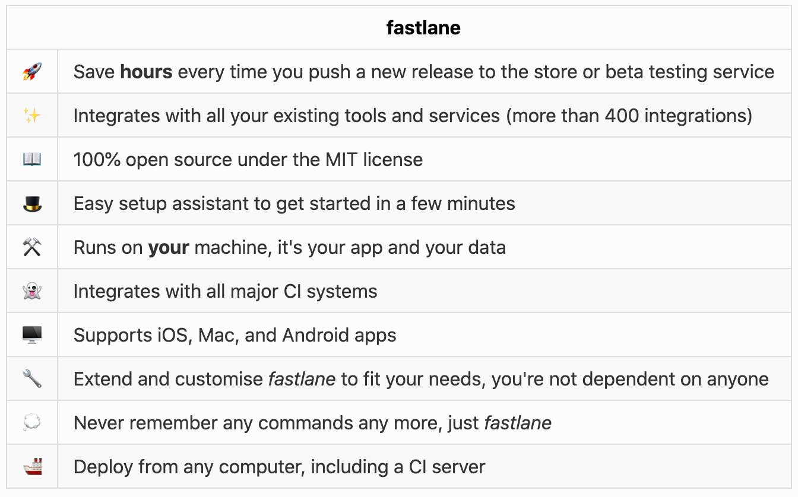

以下舉例說明：

> 撰寫腳本：
> 
```Ruby
lane :beta do
  increment_build_number
  build_app
  upload_to_testflight
end
```
> 執行腳本： 
> 
```Bash
	$ fastlane beta
```
> 執行結果：
> 
> 增加版本號、建置專案、上傳至TestFlight（若建置失敗則會跳出腳本並報錯）


安裝與設置
----
[參考連結](https://docs.fastlane.tools/)

### 安裝
- 安裝Xcode的Command line tool (用於iOS或macOS專案)

```
xcode-select --install
```
- macOS：
	
```
brew install fastlane
```
- Linux/Windows/macOS：

```
sudo gem install fastlane -NV
```
### 設置

#### 於專案根目錄執行以下指令
	
```
fastlane init
```

#### 接下來會問一些問題：
	
1. Fastlane預計用來幹嘛？
	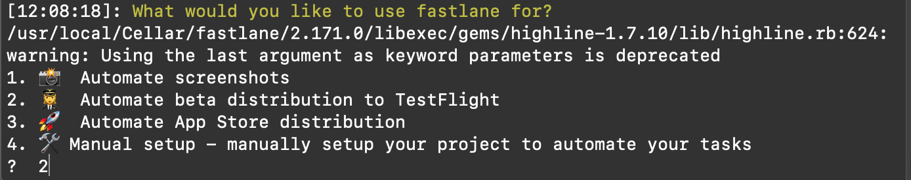
	
1. 要建置的Scheme？
	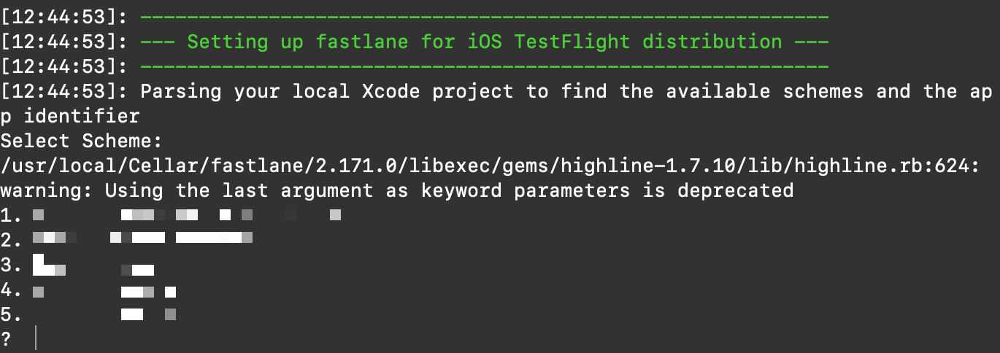
	
1. 登入Apple ID
	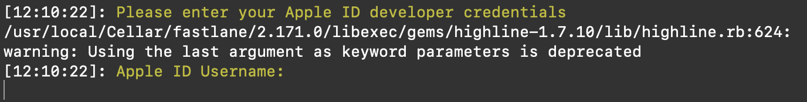
	> 請注意：登入的Apple ID必須擁有「**帳號擁有者**」、「**管理**」、「**App 管理**」、「**開發者**」當中任一身份權限才可使用，後二者需透過前二者至「App Store Connect」->「使用者與存取權限」->「該名使用者的Apple ID」開啟**Certificates, Identifiers & Profiles**存取權限(如下圖所示)，否則需在第一個問題選擇「**4**」。
	> [圖片來源](https://developer.apple.com/support/roles/)
	> 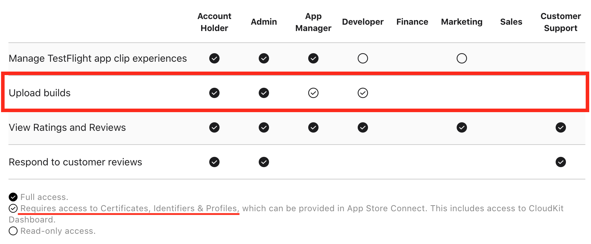
	>
	> 無法存取的畫面如下
	> 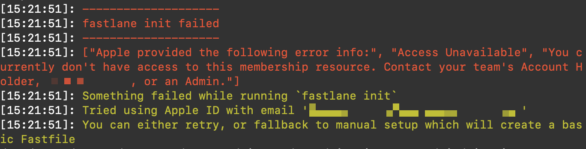
		
#### 完成後會有一連串的說明與引導提示
	
1. 初始化成功，產生了「Fastfile」、「Appfile」、「Gemfile」等三個檔案
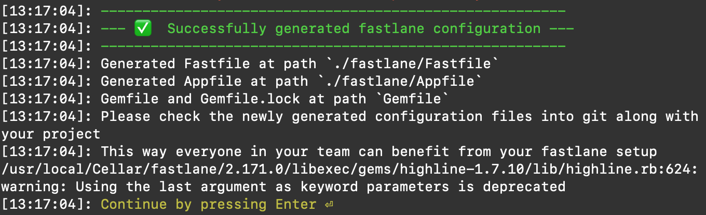
> 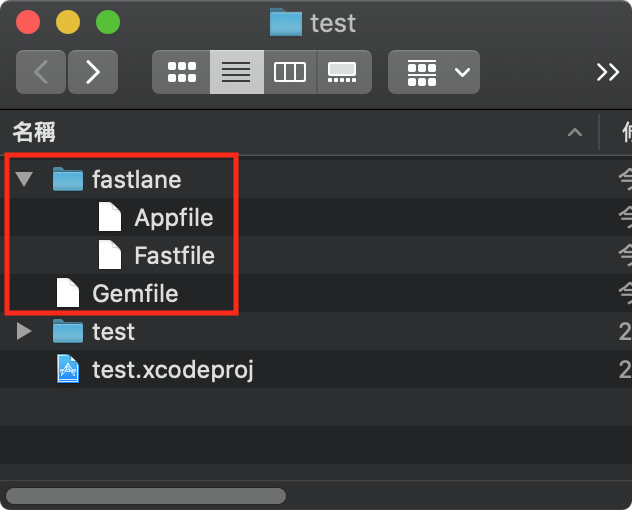

1. fastlane說明(還很好心的說明隱私資料不會被上傳)
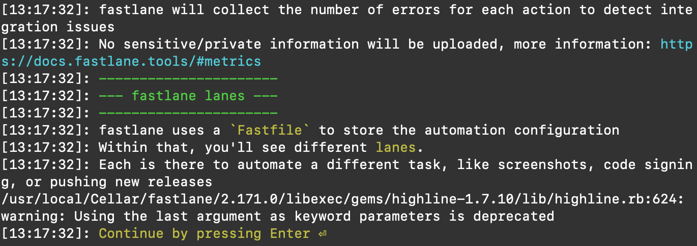
	
1. 提示如何客製化腳本
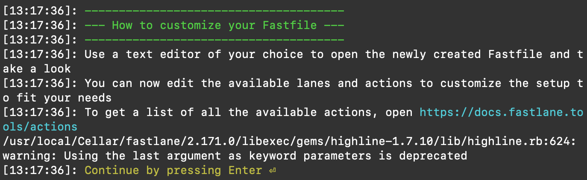
	
1. 一些文件的網址
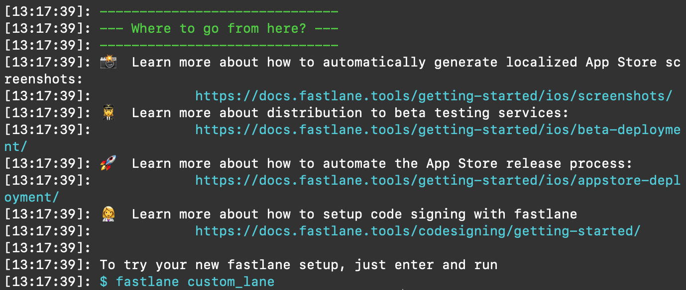

檔案說明(Fastfile、Appfile、Gemfile)
----
### Fastfile
	
用於撰寫Fastlane的腳本(`lane`)，可定義腳本的建置平台(`platfrom`)、描述(`desc`)、名稱、內容(`Action`)等。
<br id = fastfile_script> 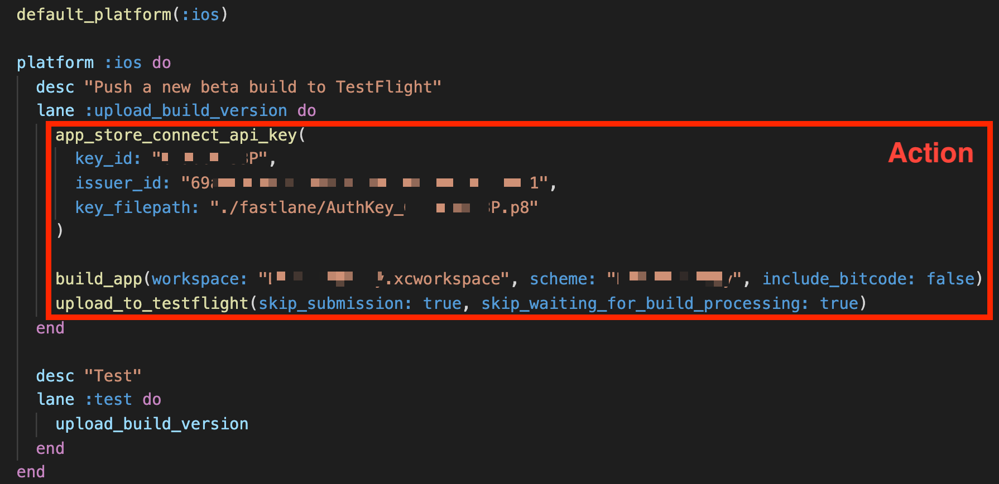

> 以上傳建置版本(**`upload_build_version`**)的腳本為例(**上圖**)，須先設定App Store上傳所需要的Api憑證(**`app_store_connect_api_key`**)，再[建置App產生ipa檔](#gym)(**`build_app`**)，最後上傳至Testflight (**`upload_to_testflight`**)，有關其他Action的使用可參考[更多工具](#Fastlane_Action)。
>
> 在其他的腳本中也可以使用已撰寫完成的腳本作為內部的Action(如上圖的`test`)
	
### Appfile
	
用於記錄專案的一些相關資訊，例如：App ID、上架用的Apple ID、App Store Connect 的 Team ID、簽署用的Team ID等。
	
```
app_identifier("YOUR.BUNDLE.ID") # The bundle identifier of your app
apple_id("YOUR_EMAIL@gmail.com") # Your Apple email address

itc_team_id("******") # App Store Connect Team ID
team_id("XXXXXXXXXX") # Developer Portal Team ID
```
	
### Gemfile

Gem是Ruby專案的第三方套件管理工具，與iOS專案中的`Cocoapods`相似，而`Gemfile`則與`Podfile`的功能相同，可透過於`Gemfile`內輸入`gem LIB_NAME`的方式新增第三方套件，而`Fastlane`與`Cocoapods`皆是使用Ruby所開發的工具，因此可以透過gem來進行掛載，而MacOS內建Ruby系統，所以可以直接使用Gem作為專案的管理工具。
	
```
source "https://rubygems.org"

gem 'cocoapods', '~>1.8.4'
gem "fastlane"
```

<h2 id = "gym">Gym(Gymfile)</h2>

[參考資料](https://docs.fastlane.tools/actions/gym/)

**Gym**是Fastlane內部的一個加速工具，可以提昇編譯的速度並簡化指令，以下是官方文件所陳列的功能。

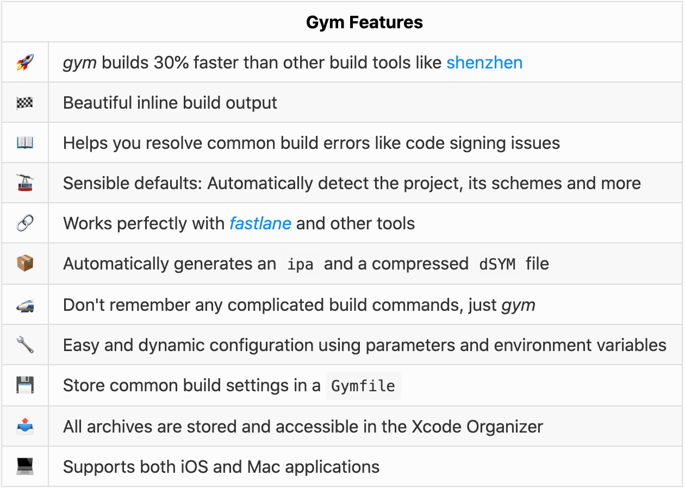

### 產生Gymfile
可透過以下的指令產生Gymfile

	fastlane gym init

### 設定編譯預設的編譯資訊
可於`Gymfile`內新增以下內容來設定要編譯設定，例如：**Workspace**、**Scheme**、**是否要Clean專案**、**輸出ipa的路徑**、**是否包含bitcode**、**輸出的相關設定(`export_options`)**等，更多設定內容可參考此[網址](https://docs.fastlane.tools/actions/gym/#parameters)或於終端機上輸入`fastlane action gym`查看。

```
workspace("DriveProBody.xcworkspace")

scheme("DriveProBody")

clean(true)

output_directory("./fastlane/build")

include_bitcode(false)

export_options({
  destination: "export",
  method: "app-store",
  signingStyle: "automatic",
  stripSwiftSymbols:true,
  uploadBitcode:false,
  uploadSymbols:true
})
```

### 使用Gym
可直接於`fastfile`內輸入`gym`或`build_app`([如圖](#fastfile_script))建置專案，或於終端機上使用`fastlane run gym`指令建置專案，專案於建置時，會自動讀取`gymfile`內的設定值作為預設值。

Scan(Scanfile)
----

[參考資料](https://docs.fastlane.tools/actions/scan/)

**scan**是Fastlane內部的一個工具，主要是用來執行測試(UITest、Unit Test)，以下是官方文件所陳列的功能。

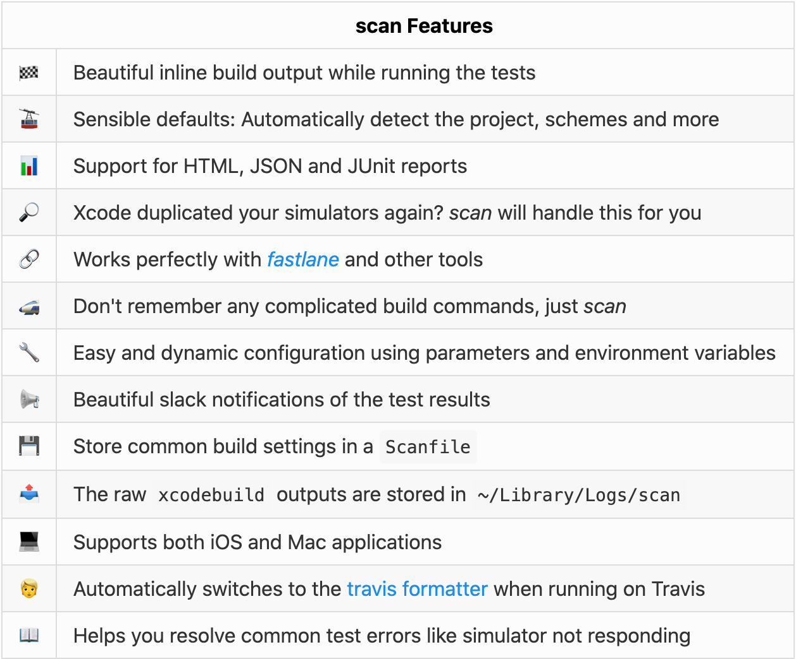

### 產生Scanfile

與**Gym**相同，也可以透過以下指令產生**Scan**專用的設定文件`Scanfile`。

	fastlane scan init
	
### 設定測試預設的參數

與**Gym**相同，可以透過`Scanfile`設定一些測試用的預設參數，例如：**Workspace**、**Scheme**、**實機測試(destination)**、**要執行測試的模擬器(device \ devices)**、**是否要重裝App(reinstall_app)**、**要重裝的app ID(app_identifier)**等(*後三個參數限模擬器使用*)，更多參數請參考[此連結](https://docs.fastlane.tools/actions/scan/#parameters)。

```
TEST_DEVICE = [
    "platform=iOS,id=f5331150370fc6ef1cb2d8f5d691a5ccc3d8e4bd"
]

workspace("DriveProBody.xcworkspace")

scheme("DriveProBody")

skip_build(true)

destination(TEST_DEVICE)
```

> - destination內可設定多台裝置，若設定多台可同時進行UITest
> - 可透過`id`與`name`來設定要測試的實體手機
> 	- id : 為裝置的UUID，可於`Finder`->`裝置名稱`內查詢到
> 	- name : 為裝置的名稱

### 使用Scan
於終端機內或`fastfile`內輸入以下指令

	fastlane scan

或

	fastlane run_tests

### 測試結果
測試完成後(無論成功或失敗)，可在專案根目錄的 fastlane/test_output 中查看測試報告(如下圖)。

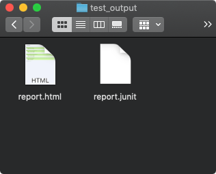

開啟`report.html`可查看執行了哪些測試，與每個測項的測試結果，若測試失敗則會顯示失敗的位置與丟出的錯誤。


<h2 id = "Fastlane_Action">更多工具</h2>
[參考連結](https://docs.fastlane.tools/actions/)

除了上述介紹的編譯工具`gym`與測試工具`scan`之外，`fastlane`還提供了其他的工具，也有分別針對Android、iOS和MacOS所使用的工具(或指令)，以下例舉幾項。

- 測試工具(指令)
	
	- scan：測試iOS與MacOS專案使用，可透過專案內的XCTest撰寫測試程式，並生成測試報告。
	- [appium](http://appium.io/)：支援多個平台的UITest，包含iOS、Android、MacOS、Windows。*(若要建置iOS或MacOS專案，還是需要將工具裝在MacOS上)*

- 建置工具(指令)
	
	- gym：與`build_app`指令相同，用於建置iOS與MacOS的專案。
	- [cocoapods](https://cocoapods.org/about)：用於執行`pod install`，可於`Fastfile`內定義更新Pod的時機。
	- [carthage](https://github.com/Carthage/Carthage)：與`cocoapods`相似的第三方Library管理工具，兩者的比較可參考此[連結](https://blog.embrace.io/should-you-use-cocoapods-or-carthage/)，也是用於設置第三方Library。
	- [gradle](https://docs.gradle.org/current/userguide/userguide.html)：用於建置Android專案。
	- [adb](https://developer.android.com/studio/command-line/adb)：Android debug bridge的簡稱，如其名用於建置Android專案。
	
- 截圖工具(指令)
	
	- [snapshot](https://docs.fastlane.tools/actions/snapshot/)：與`capture_ios_screenshots `指令相同，可用來產生iOS或MacOS專案中，多國語系或各種螢幕大小的畫面截圖，其原理是結合XCTest與模擬器來完成「產生截圖」的繁瑣工作。
	- [screengrab](https://docs.fastlane.tools/actions/screengrab/)：與`capture_android_screenshots `指令相同，也是透過UITest與模擬器來產生Android App的截圖，同樣可產生多國語系或各種銀幕大小的截圖。

- 專案指令 ( iOS或Mac專用 )
	
	- [increment\_build\_number](https://docs.fastlane.tools/actions/increment_build_number/)：增加或設定**建置**版號，可與App Store Connect相關指令`latest_testflight_build_number`一起使用，達成**自動增加建置版號**的功能。
	- [get\_version\_number](https://docs.fastlane.tools/actions/get_version_number/)：取得目前專案的**發布**版號(Release version)。
	- [get\_build\_number](https://docs.fastlane.tools/actions/get_build_number/)：取得目前的**建置**版號。
	- [increment\_version\_number](https://docs.fastlane.tools/actions/increment_version_number/)：增加或設定**發布**版號(Release version)
	
- 發布測試版(主要是針對Testflight，[其他測試平台](https://docs.fastlane.tools/actions/#beta))
	
	- [upload\_to\_testflight](https://docs.fastlane.tools/actions/upload_to_testflight/)：與`pilot`、`testflight`指令相同，可透過Apple ID上傳`ipa`檔至Testflight，還可透過設定值，將上傳的版本發佈給指定的測試人員或測試群組進行測試，也可以透過**App Store Connect API**來上傳`ipa`，使用方法可參考下方的[補充說明](#App_store_connect_api)，此外，此指令預設會再上傳完畢後等待Testflight的處理程序，直到可提供下載測試才算完整的程序，若要忽略等待時間，可設定`skip_waiting_for_build_processing`為`true`即可忽略Testflight的處理程序。
	
- 發布正式版
	
	- [upload\_to\_app\_store](https://docs.fastlane.tools/actions/upload_to_app_store/)：與`deliver`、`appstore`指令相同，可將`ipa`或`pkg`上傳至App store，並自動輸入多國語系的Release note與App截圖，設定送審前需要設定所有資訊(如：`app_review_information`、`automatic_release `等)，最後再送審前會做預先檢查的動作(`run_precheck_before_submit `)，更多功能請參考前方網址。
	- [upload\_to\_play\_store](https://docs.fastlane.tools/actions/upload_to_play_store/)：與`supply`指令相同，用於上傳Android的App，詳情可查看前方網址。
	
- [版本控制](https://docs.fastlane.tools/actions/#source-control)

	- git_branch：取得目前的分支名稱
	- last\_git\_commit：取得最新的commit訊息與作者
	- git_pull
	- last\_git\_tag：取得最新的Tag
	- push\_to\_git\_remote：同步本地資料庫至遠端
	- add\_git\_tag：新增Tag
	- git\_tag\_exists：判斷Tag是否存在
	- git_commit
	- push\_git\_tags：將本地端的Tag同步至遠端
	- git_add
	
- [通知](https://docs.fastlane.tools/actions/#notifications)：各種通訊軟體的Api

	- [slack](https://slack.com/intl/en-tw/)
	- notification：mac內部的通知訊息，可以自行設定點擊跳轉的URL。
	- [mailgun](https://www.mailgun.com/)：一個代寄Email的API服務。
	- [twitter](https://developer.twitter.com/en/docs/authentication/overview)：自動Twitter發文，詳情請看Twitter API文件

- App Store Connect

	- [create\_app\_online](https://docs.fastlane.tools/actions/create_app_online/)：與`produce`指令相同，可在App Store Connect上建立一個新的App，同時設定一些應用程式服務，如：`App Group`、`iCloud`、`Push Notification`、`SiriKit`等。
	- [check\_app\_store\_metadata](https://docs.fastlane.tools/actions/check_app_store_metadata/)：與`precheck`指令相同，用於檢查一些上架用的基本資訊，結果如下圖(授權資訊未更新為2021)。<br>
	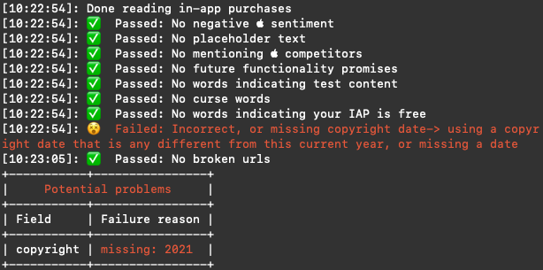
	- latest\_testflight\_build\_number：取得Testflight上最新的**建置**版號。
	- app\_store\_build\_number：取得目前發布或待發布的**建置**版號。
	- set_changelog：設定`版本資訊`中的**`此版本的新增功能`**。
	- [app\_store\_connect\_api\_key](https://docs.fastlane.tools/actions/app_store_connect_api_key/)：用於設定api key，詳請請看下方[補充說明](#App_store_connect_api)。
	
- 其他指令

	- update_fastlane：更新`Fastlane`版本。
	- puts：印出輸入的字串 ( Debug用 ) 。
	- fastlane_version：顯示目前`Fastlane`版本。
	- backup_xcarchive：備份`Archive`的輸出。
	- zip：壓縮資料夾或檔案。
	- [install\_on\_device](https://docs.fastlane.tools/actions/install_on_device/)：安裝一個`ipa`檔至iOS裝置，可透過WiFi或USB安裝。
	- [google\_play\_track\_version\_codes](https://docs.fastlane.tools/actions/google_play_track_version_codes/)：取得play商店內的App版號(Android用)

- 更多指令([fastlane Plugins](https://docs.fastlane.tools/plugins/using-plugins/))
	
	若想使用的功能並未出現在上述的功能中，有兩種方案可以選擇：
	- [自行撰寫本地端的Action](https://docs.fastlane.tools/create-action/#local-actions)
	- [使用第三方的外掛程式](https://docs.fastlane.tools/plugins/available-plugins/)

	常用的第三方外掛程式：
	
	- [App Center](https://github.com/microsoft/fastlane-plugin-appcenter)：微軟所提供的App管理工具。
	- [Firebase App Distribution](https://github.com/fastlane/fastlane-plugin-firebase_app_distribution)：`Firebase`上發布App測試版本工具。
	- [versioning](https://github.com/SiarheiFedartsou/fastlane-plugin-versioning)：自動管理版本號的工具。
	
	以下是透過`versioning`工具結合**App Store Connect**指令所實作的自動進版腳本：

``` Ruby
desc "Check version number & build number"
lane :check_and_auto_increment_version_number do
	release_version = get_app_store_version_number(bundle_id:'com.transcend.DriveProBody')
	now_version = get_version_number(xcodeproj:"DriveProBody.xcodeproj", target:"DriveProBody")
	if release_version == now_version
		#increment version & set build number to 1
		increment_version_number_in_xcodeproj(
			bump_type: 'minor',
			version_source: 'appstore',
			bundle_id:'com.transcend.DriveProBody',
			omit_zero_patch_version: true
		)
		increment_build_number({
			build_number: 1,
			xcodeproj: "DriveProBody.xcodeproj"
		})
	else
		#increment build number
		last_build_number = latest_testflight_build_number
		increment_build_number({
			build_number: last_build_number + 1,
			xcodeproj: "DriveProBody.xcodeproj"
		})
  	end
end
```

補充說明
----
<h3 id="App_store_connect_api"> App Store Connect API</h3>
[參考資料](https://developer.apple.com/documentation/appstoreconnectapi)

App Store Connect API是Apple提供給開發人員所使用的REST API，可透過此API執行App Store Connect上的操作，功能如下圖。

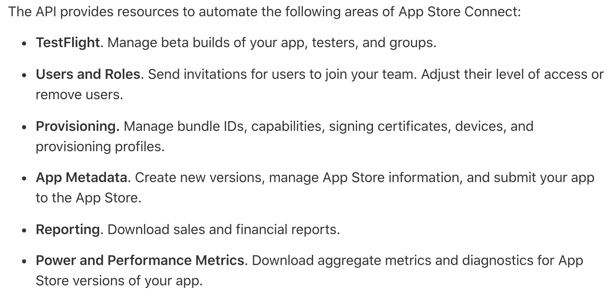

要使用此API需要產生一組API Key，詳情請參考[Apple官方連結](https://developer.apple.com/documentation/appstoreconnectapi/creating_api_keys_for_app_store_connect_api)，產生完成後會得到一組`key_id`、`issuer`和一個`.p8檔`，將`.p8檔`移至專案中的Fastlane資料夾內(如下圖)。

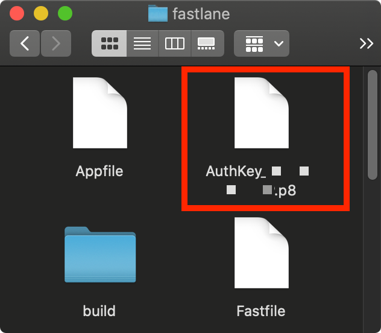

並透過`Fastlane`的`app_store_Connect_api_key`指令將`key_id`、`issuer`和`.p8檔`的路徑設定至`Fastlane`，之後再使用App Store Connect指令時，會自動帶入此金鑰，範例程式如下。

```
desc "Push a new beta build to TestFlight"
lane :upload_build_version do
  app_store_connect_api_key(
    key_id: "YOUR_KEY_ID",
    issuer_id: "YOUR_ISSUER_ID",
    key_filepath: "./fastlane/YOUR_KEY_FILE.p8"
  )
  check_and_auto_increment_version_number
  build_app
  upload_to_testflight(skip_submission: true, skip_waiting_for_build_processing: true)
end
```
