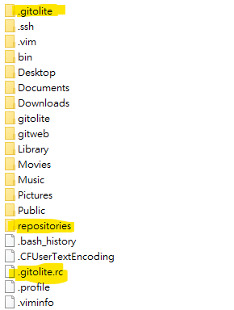
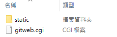
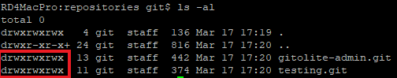
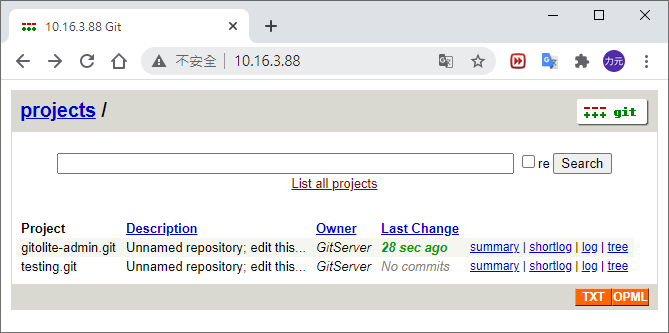
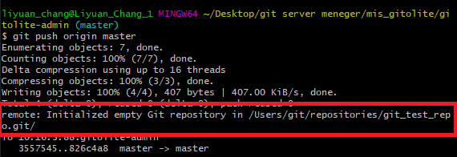
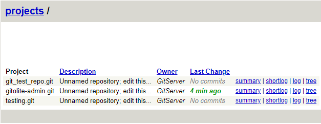

# 架設Gitolite與使用Gitweb

## 前言

因主管要求，此Gitolite的硬體與OS版本如下：
> 硬體：MacPro1,1 (Mid 2006)
> 
> OS：Mac OS X 10.7 Lion

電腦已安裝Redmine，故內含有apache server v2.2.22

## 前置作業

### 更新openssl

[參考資料](http://ocdman.github.io/2018/10/08/Mac-OS-X-Lion-10-7-4-%E5%A6%82%E4%BD%95%E5%AE%89%E8%A3%85Homebrew/)

由於該電腦的TSL版本過舊，導致無法從Github上clone code，因此需要更新openssl工具

查看openssl版本的指令如下

    openssl version

由於沒有任何安裝工具(Homebrew, apt-get)所以只能用手動下載的方式來安裝

至[openssl官網](https://www.openssl.org/source/)下載最新的版本(v3.0.0)並透過以下指令進行安裝

    //確認原始openssl工具的路徑
    which openssl // print /opt/local/bin/openssl
    //備份，依照輸出結果更換備份位置
    sudo mv /opt/local/bin/openssl /opt/local/bin/openssl_backup
    //解壓縮下載檔案
    tar xvf openssl-3.0.0-alpha12.tar.gz
    //安裝
    cd openssl-3.0.0-alpha12
    sudo ./Configure darwin64-x86_64-cc --prefix=/usr/local/openssl
    sudo make && make install
    //建立連結至原始位置
    sudo ln -s /usr/local/openssl/bin/openssl /opt/local/bin/openssl

### 安裝Xcode與Xcode Command line tools

至[Apple官網](https://developer.apple.com/download/more/)下載符合OS版本的Xcode與Command line tools，由於OSX 10.7最新只是用Xcode 4.6.3，並找到Command line tools(OS X Lion)for Xcode，下載這兩個檔案並安裝。

完成後，透過以下指令指定Command line tool所使用的Xcode路徑

    xcode-select -switch /Applications/Xcode.app/Contents/Developer

### 踩雷

在找問題的過程中曾經把git弄壞了，在此紀錄重裝git的方法

使用Macport工具，可至[官網](https://www.macports.org/install.php#installing)下載各種版本的pkg檔安裝，完成後夠過已下指令安裝git

    sudo port install git

## 安裝gitolite

[參考資料](https://gitolite.com/gitolite/quick_install.html)

於OS內建立新的使用者，使用者名稱為`git`，此名稱會用於之後clone code所使用的SSH前綴，若不設定為git也可以。

    //SSH URL格式:使用者名稱@伺服器IP:專案路徑
    git@10.16.3.88:testing.git

接著輸入以下指令安裝gitolite
```
//切換使用者至git的使用者
su - git

//建立一個bin的資料夾，若有則可省略此步驟
mkdir -p ~/bin

//clone gitolite專案，建議下載至使用者的Home
git clone https://github.com/sitaramc/gitolite

//安裝置bin資料夾下，請使用絕對路徑
gitolite/install -ln ~/bin

//設定gitolite的公鑰
gitolite setup -pk yourname.pub

```

> 產生成對私鑰公鑰的方法如下：
    
    //自行替換下方的email address，會生成至目前的目錄下
    ssh-keygen -t rsa -b 4096 -C "$memberName@transcend-info.com"
----
完成後使用者的Home目錄如下圖



> .gitolite：用於存放gitolite專案設定檔(repository的列表與讀寫權限)、公鑰與log檔
> 
> repositories：用於存放每個專案的repositories，也是gitweb讀取的對象
> 
> .gitolitw.rc：設定gitolite相關參數的檔案
> > 重要參數 
> > 
> >`UMASK` ：用於設定gitolite新增repository檔案的讀寫權限，為了使gitweb可以順利讀取repository，須將此參數設定為 **0022**(0000為權限全開，0777為全關，與chmod互補)。

* 為確保gitolite正常運作，請務必使用新建立的User來設置gitolite，避免產生找不到repositories資料夾的問題。
----
此時透過剛剛設定的公鑰，可直接將gitolite的設定專案clone下來，指令如下

    git clone git@your-server-ip:gitolite-admin

* 若出現需要打密碼的狀況，請確認電腦內的.ssh資料夾是否擁有與剛剛設定公鑰成對的私鑰。

## gitweb

在MacOS和linux系統中，透過cmd安裝git工具後，隨即含有gitweb的相關檔案，可以在**usr/local/share/gitweb**內找到(依照git安裝的位置可能有些許不同)，資料夾的內容如下圖所示。



> gitweb.cgi：用於顯示gitweb的網頁
> 
> static：內含有一gitweb網頁上的圖片、JS腳本和CSS樣式。

----
首先，使用指令將gitweb資料夾複製至Home底下，指令如下

    sudo cp -R /usr/share/gitweb /Users/git/

接著設定apache的虛擬主機，開啟**etc/apache2**資料夾，於`httpd.conf`內新增以下程式。
```
<VirtualHost *:80>                  #設定port為80(即預設port)
    DocumentRoot /Users/git/gitweb  #要顯示網頁的根目錄，輸入gitweb的路徑
    <Directory /Users/git/gitweb>   #設定此目錄的讀檔形式

        #--------支援cgi格式---------
        Options +ExecCGI +FollowSymLinks +SymLinksIfOwnerMatch
        AddHandler cgi-script cgi
        #---------------------------

        DirectoryIndex gitweb.cgi   #初始目錄為gitweb
        AllowOverride All
        order allow,deny
        Allow from all
    </Directory>
</VirtualHost>
```
* 此處為apache 2.2.22的處理狀況，若apache版本為2.4.X則是修改`apache.conf`或至`./conf-available/gitweb.config`內修改gitweb的路徑。

----
接著，回到**Home/gitweb**編輯gitweb.cgi，為了避免權限問題，建議透過終端機中的vi來編輯檔案，指令如下。

    sudo vi gitweb.cgi

於檔案內找到`projectroot`變數，將之修改為Home目錄下的repositories，如下所示。

    ....
    our $projectroot = "/Users/git/repositories/";
    ....

----
最後，修改repositories資料夾內所有檔案的權限，指令如下。

    sudo chmod -R 777 /Users/git/repositories

設定完成後可透過以下指令查看權限

    ls -al



完成後開啟瀏覽器輸入Server IP即可看到Gitweb網站。



## 實測

### 新增repository

Clone gitolite-admin專案

    git clone git@10.16.3.88:gitolite-admin

於`conf/gitolite.conf`內新增以下程式

    repo git_test_repo      #專案名稱
        RW+     =   @all    #讀寫權限

將修改內容push至gitolite Server上

    git add .
    git commit -m "新增測試專案"
    git push orign master

結果如圖所示



