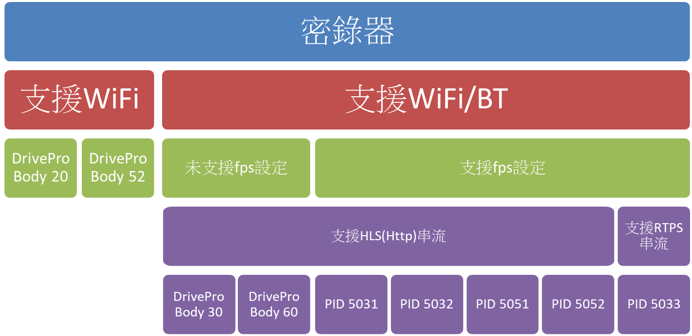
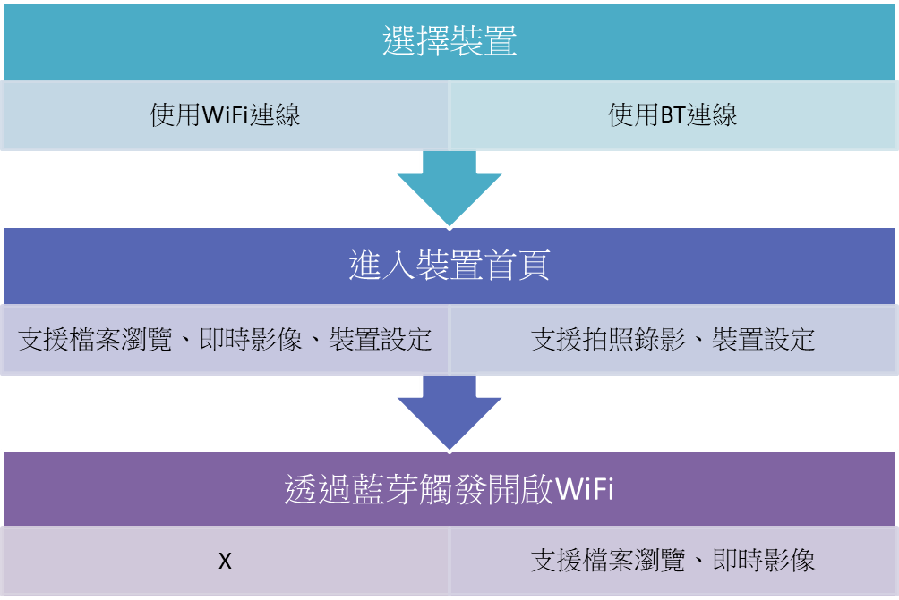

# 密錄器 APP(iOS)

透過 BT 與 WiFi 控制公司的密錄器產品，達到顯示即時畫面(Streaming)、瀏覽與下載錄製影像、控制裝置狀態等功能。

## 密錄器產品

密錄器產品大致可分為只支援 WiFi 和支援 BT/WiFi 的產品(APP 支援的部分)，依照連線上取得的產品資訊來判斷該產品的性質，詳細的產品分類如下圖所示。

## 軟體功能支援

- WiFi

  透過 WiFi 達成顯示即時影像與檔案下載瀏覽功能

- Bluetooth(BLE)

  透過藍芽控制裝置狀態與觸發拍照錄影

操作流程大致如下圖所示

### 韌體更新

透過手機 4G/5G 網路與 Firebase 的 Realtime DB 和 Storage，確認並下載至手機，完成後在透過 Http 將下載的韌體 Bin 檔上傳至裝置。

### 即時影像串流

- HLS

  使用瀏覽器元件開啟自訂的 HTML 檔，並於該檔案中設定訪問的網址，確保顯示的畫面範圍可控制。

- RTSP

  使用 VLC Player 播放 RTSP 串流，由於有商用受權(LGPL v2.1)問題，需部分揭露程式碼。

### 檔案瀏覽

使用原生 AVFoundation 內的 AVPlayer 播放檔案

- 遠端

  透過 URL 初始化 AVPlayerItem。

- 本地端

  透過相簿讀取 PHAsset 轉換為 AVAsset，在初始化 AVPlayerItem。

### 影片剪輯

使用 mobileffmpeg 第三方資源庫與客製化 UI 實現遠端與本地端影片剪輯功能，後續有遇到 mobileffmpeg 與 VLC 內 ffmpeg 版本衝突的問題，透過 cocoapod 腳本於編譯時調整編譯順序解決。

### 取得裝置電量與容量

- 藍芽 Notify

  使用系統原生的藍芽框架，透過 Delegate 接收 Notify 顯示裝置的電量與容量

- Socket

  與裝置建立 Socket 連線，定期接收電量與容量資訊。

### 快速配對 UI

透過藍芽搜索附近名稱符合指定規則的裝置，於 APP 內跳出配對通知，並要求使用者長按裝置物理按鈕進行配對。

### 數據收集

使用 Firebase 收集 APP 的 Crash 資訊，並透過 Event 與非嚴重錯誤，收集使用者操作行為與偏好數據，進一步調整 UI 設計。
