使用gitlab-runner和Firebase App Distribution達成CI/CD 工作流程
====
Ex. iOS project

CI/CD工作流程簡述
----
觸發時機：將「commit提交」或使用「merge request合併」至GitLab指定分支

工作流程：(先設定好`.gitlab-ci.yml`檔案，並於Runner上安裝Firebase CLI)

1. gitlab-runner會自動clone code至本地端

2. 判斷分支執行不同的`Pipeline`

3. `Pipeline`是由`Jobs`和`Stages`組成，Runner會依照`.gitlab-ci.yml`內的設定自動產生對應的`Pipeline`

	`Stages`：設定`Pipeline`有幾個階段要執行

	`Jobs`：設定屬於哪個`stage`、哪個分支需要執行和執行的`scripts`

4. 透過`Jobs`內的`scripts`執行`xcodebuild`生成`ipa`

5. 透過`Jobs`內的`scripts`執行`Firebase`指令上傳`ipa`
<br>


Install gitlab-runner
----
[參考連結](https://docs.gitlab.com/runner/ "GitLab runner install")
<br>(安裝Runner於MacOS，其他系統可參考上方連結)

1. 安裝GitLab Runner 
	
		brew install gitlab-runner
	
2. 啟動Runner服務

		brew services start gitlab-runner

3. 註冊Runner
	
		gitlab-runner register

	需要輸入以下資訊：
		
	> 輸入GitLab server ip
	>>https://gitlab.com/
	
	>輸入Token<br>
	>>Token可以從「gitlab > Settings > CI/CD > Runners > Expand > Set up a specific Runner manually > Point 3.」取得
	
	>輸入描述，之後在GitLab網站上作設定
	
	>輸入標籤(tag)，可以用來決定之後的job要在哪個Runner上執行，也可以稍後再設定
	>>輸入「release」
	
	>設定executor，可以使用Docker作為模擬編譯環境
	>> 輸入「Shell」

4. 確認Runner是否正常運作
	> 在「gitlab > Settings > CI/CD > Runners > Expand」可查看Runner狀態
 
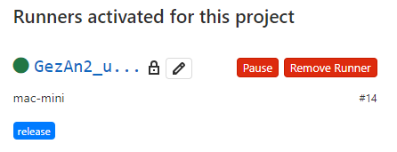

* 其他說明：
	
	若使用Docker作為executor，需在`.gitlab-ci.yml`內透過`default image`參數來設定platform<br>
	
	若要修改以上參數可以至`.gitlab-runner/config.tlom`修改<br>
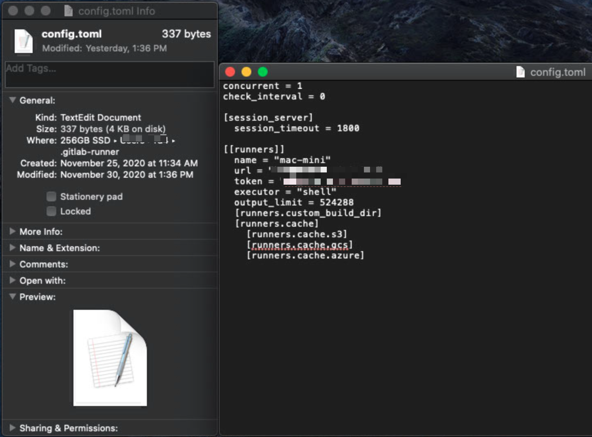

專案設定
----
#### 設定`.gitlab-ci.yml`檔
1. 新增`.gitlab-ci.yml`檔案
	在gitlab上點選「Project overview > Details」，確認檔案的路徑與分支後，點選「＋」，選擇「New file」<br>  <br> 選擇「`.gitlab-ci.yml`」新增檔案<br> 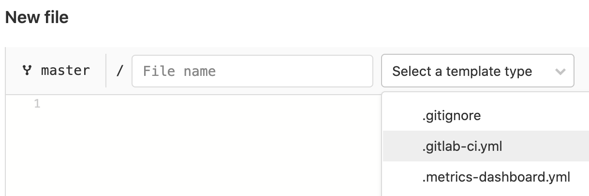

2. 設定`.gitlab-ci.yml`檔案內容

```
stages:
  - build
  - release

variables:
  LC_ALL: "en_US.UTF-8" # apparently xcpretty won't function correctly otherwise
  LANGUAGE: "en-US.UTF-8"
  LANG: "en-US.UTF-8"

before_script:
  - export LC_ALL=en_US.UTF-8
  - export LANGUAGE=en-US.UTF-8
  - export LANG=en-US.UTF-8
  - pod install
  - xcodebuild clean -workspace YOUR_PROJECT_NAME.xcworkspace -scheme YOUR_PROJECT_NAME -configuration Release -quiet

build_project:
  stage: build
  script:
  - xcodebuild -workspace YOUR_PROJECT_NAME.xcworkspace -scheme YOUR_PROJECT_NAME -configuration Release -quiet

  tags:
    - release

release_project:
  stage: release
  script:
  - xcodebuild archive -workspace YOUR_PROJECT_NAME.xcworkspace -scheme YOUR_PROJECT_NAME -configuration Release -archivePath archive/YOUR_PROJECT_NAME.xcarchive
  - xcodebuild -exportArchive -archivePath archive/YOUR_PROJECT_NAME.xcarchive -exportPath release -exportOptionsPlist ReleaseInfo/ExportOptions.plist
  - firebase appdistribution:distribute release/YOUR_PROJECT_NAME.ipa --app YOUR_APP_ID --release-notes-file "ReleaseInfo/release-notes.txt" --groups "YOUR_FIREBASE_TEST_GROUP_NAME" --token "YOUR_FIREBASE_API_TOKEN" --debug
  only:
    - master
  tags:
    - release
```
#### 標籤說明：
`stages`：
	設定CI流程階段，目前分為`build`和`release`階段

`variables`：
	設定變數，此處用來設定編碼格式

`before_script`：
	設置要執行每個`Job`之前會執行的指令，由於在執行`Job`之前，專案會被回覆成從Gitlab上clone下來的狀態，為了使後續的Job可以正常執行，須先進行一些前置作業，如：`pod install`、`xcodebuild clean`等

`build_project ` & `release_project `：
	`Jobs`的名稱，可設定`stage`、`script `、`only `、`tags `等參數

>`stage`：指定此`Job`是屬於哪個`stages`
> 
> `script `： 設定`Job`要執行的指令
>
>`only `：指定分支名稱才可執行此`Job`
>
>`tags `：指定此`Job`要執行在哪個Runner上

#### 備註：
1. 執行`xcodebuild -exportArchive`指令前，必需先新增`ExportOption.plist`檔至專案中，詳情請見[Xcodebuild Archive設置](#Xcodebuild_Archive_Setting)
2. `script`中`firebase`的指令需先在Runner的電腦上安裝`Firebase CLI`，啟用Firebase指令並取得`token`後才可正常執行，詳情請見[Firebase CLI 安裝與取得Token](#Firebase_CLI_Install)

<h2 id="Xcodebuild_Archive_Setting">Xcodebuild Archive設置</h2>

1. `xcodebuild archive`指令：用於輸出`.xcarchive`檔，與Xcode內的`Archive`相同
		
	Demo

		xcodebuild archive -workspace YOUR_PROJECT_NAME.xcworkspace -scheme YOUR_PROJECT_NAME -configuration Release -archivePath archive/YOUR_PROJECT_NAME.xcarchive

	參數說明
	> `-workspace` ： 設定專案

	> `-scheme`： 設定要建構的`scheme`

	> `-configuration`：設定建構的方法，此時是使用`Release`

	> `-archuvePath`：設定`archive`成功後，輸出`.xcarchive`檔的位置

2. `xcodebuild -exportArchive`指令：用於將`.xcachive`檔包裝成上架用的`.ipa`檔

	Demo
	
		xcodebuild -exportArchive -archivePath archive/YOUR_PROJECT_NAME.xcarchive -exportPath release -exportOptionsPlist ReleaseInfo/ExportOptions.plist
		
	參數說明
	> `-archivePath`：設定讀取`.xcarchive`檔的位置
	
	> `-exportPath`：設定輸出`.ipa`檔的位置
	
	> `-exportOptionsPlist`：包裝成`.ipa`檔的一些基本資料，可[透過Xcode自動產生](#export_option_plist)
	
	<h7 id="export_option_plist"> 產生`ExportOptions.plist`</h7>
	
	1. 開啟專案並執行Archive<br>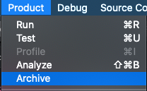
	2. 選擇`Distrubute APP`<br>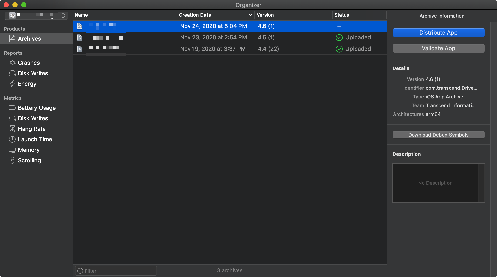
	3. 選擇`Development`<br>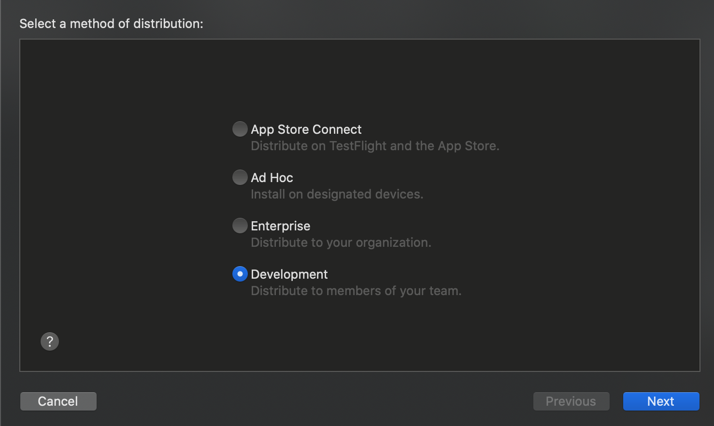
	4. 設定`Development`的描述選項<br>
	5. 自動簽署<br>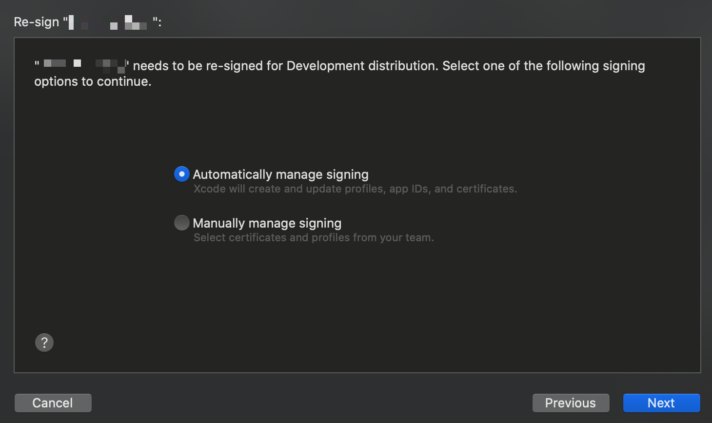
	6. 輸出`.ipa`檔<br>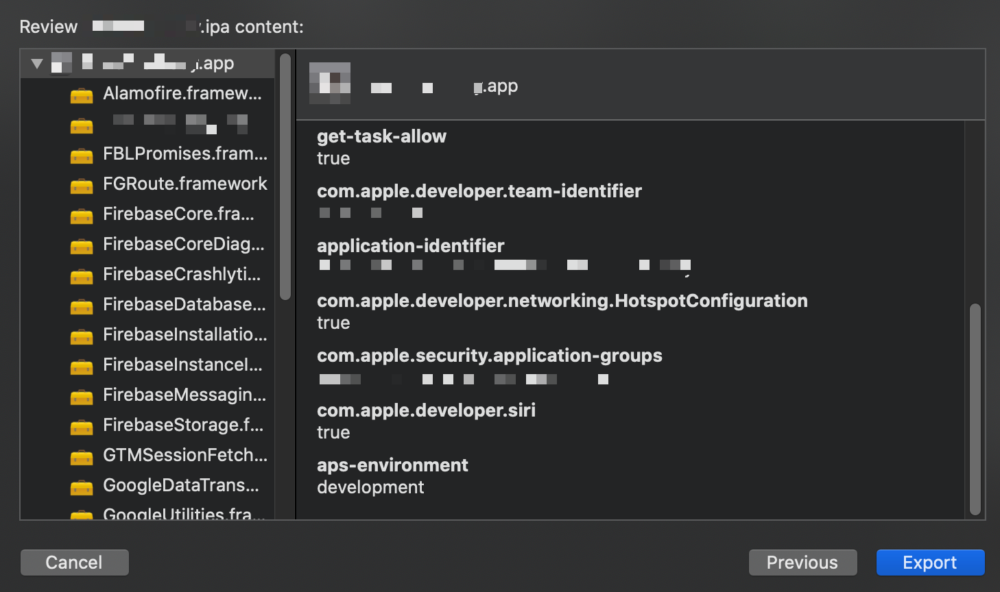
	7. 開啟輸出資料夾，即可發現`ExportOptions.plist`<br>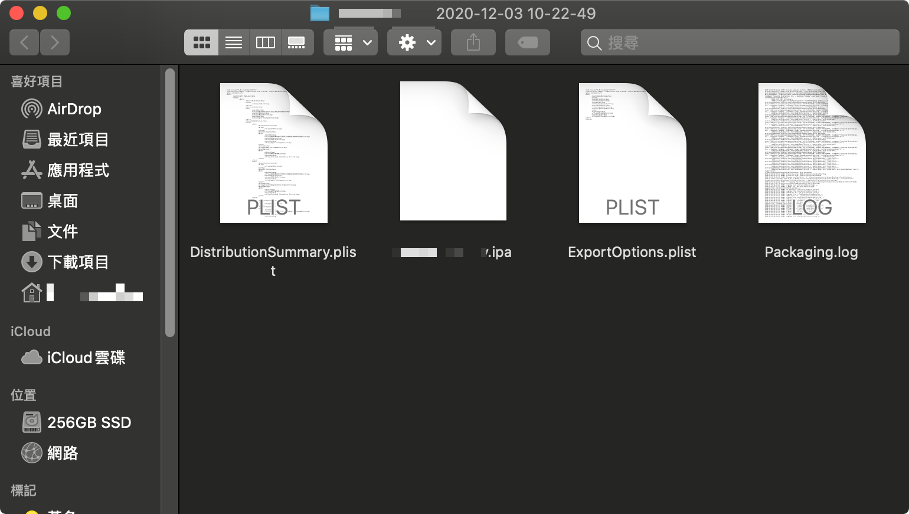

<h2 id="Firebase_CLI_Install">Firebase CLI 安裝與取得Token</h2>

### 安裝

[參考連結](https://firebase.google.com/docs/cli?authuser=0#install-cli-mac-linux "Firebase CLI install")

執行以下指令安裝`Firebase CLI`

```
curl -sL https://firebase.tools | bash
```

<h3 id="Get_Token">登入並取得Token</h3>
輸入以下指令進行登入

```
firebase login:ci
```

輸入完成會自動開啟瀏覽器，進入Google登入畫面<br>
登入完成後，關閉瀏覽器，終端機畫面上會顯示Firebase CI所使用的*Token*<br>
紀錄*Token*，使用Firebase指令時，透過 **--token " *Token* "** 來設置

### 使用指令發布至Firebase App Distribution

[參考資料](https://firebase.google.com/docs/app-distribution/ios/distribute-cli?authuser=0#distribute)

1. <h5 id="get_app_id">取得`App ID`:</h5> 

	開啟Firebase Console，點擊左上角「齒輪」進入「專案設定」<br>  <br> 選擇指定的應用程式，即可看到`應用程式ID`<br> 
2. <h5 id="set_test_group">設置測試群組:</h5>

	進入Firebase App Distribution頁面 <br> 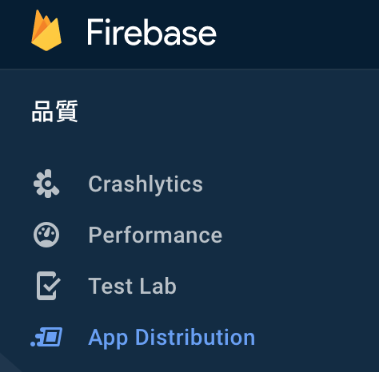  <br> 點擊 **邀請連結** 的功能分頁，新增邀請連結，並將新增的連結分享給測試人員 <br> 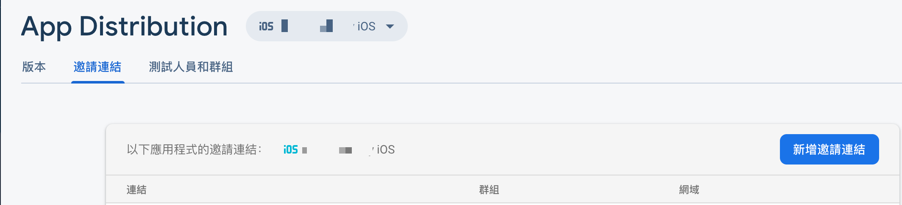 <br> 測試人員同意邀請後，即可在**測試人員和群組**的功能分頁中看到，並可以透過**新增群組**功能將指定的人員分配至指定群組中 <br> 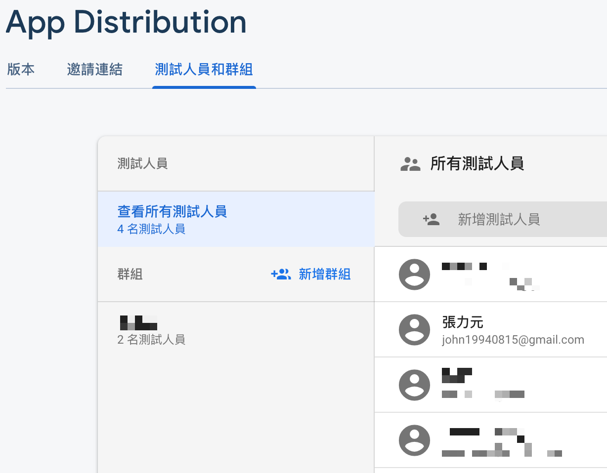<br>
3. <h5 id="setup_release_note">設置Release note: </h5>

	於專案目錄中新增一個`txt`檔，並於檔案內輸入要顯示的Release note <br> 
4. <h5>使用指令上傳`.ipa`至App Distribution</h5>

	Demo
		
		firebase appdistribution:distribute release/YOUR_PROJECT_NAME.ipa --app YOUR_APP_ID --release-notes-file "ReleaseInfo/release-notes.txt" --groups "YOUR_FIREBASE_TEST_GROUP_NAME" --token "YOUR_FIREBASE_API_TOKEN" --debug


	參數說明
	> `--app`：輸入取得的 [APP ID](#get_app_id)
	
	> `--groups`：輸入設定的 [測試群組](#set_test_group) 名稱，也可以透過`--groups-file`參數，讀取指定的`.txt`檔
	
	> `--release-notes-file`：輸入 [Release note的路徑](#setup_release_note) ，也可以透過`--release-notes`直接輸入
	
	> `--token`：輸入取得的 [Token](#Get_Token)
	
	> `--debug`：將指令執行結果紀錄至log file內，log file會自動於根目錄產生
	
	> `--testers` & `--testers-file`：可以直接設定測試人員的Email，或將測試人員的Email輸入至`.txt`檔中
	
執行結果
----

#### Job執行成功

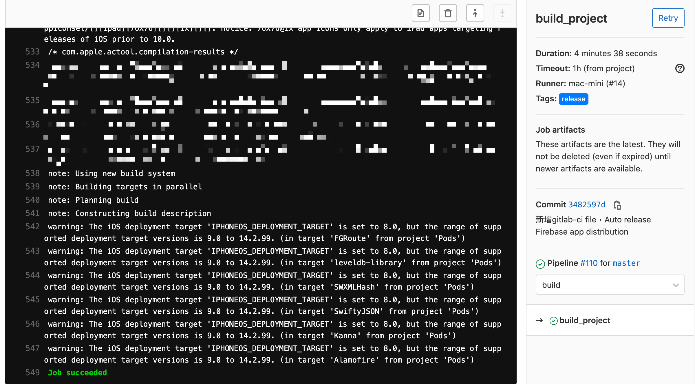

#### 成功上傳至Firebase App Distribution
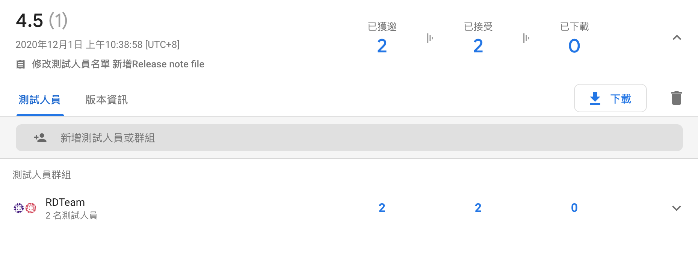
