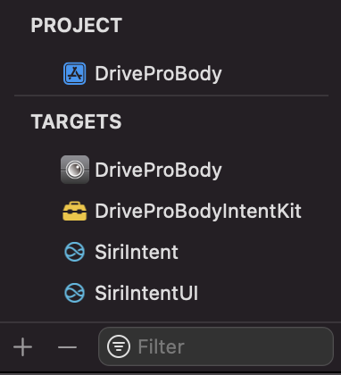
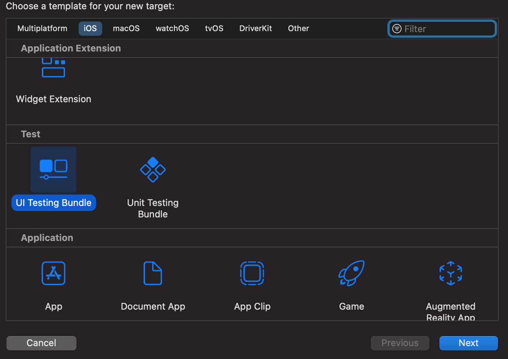
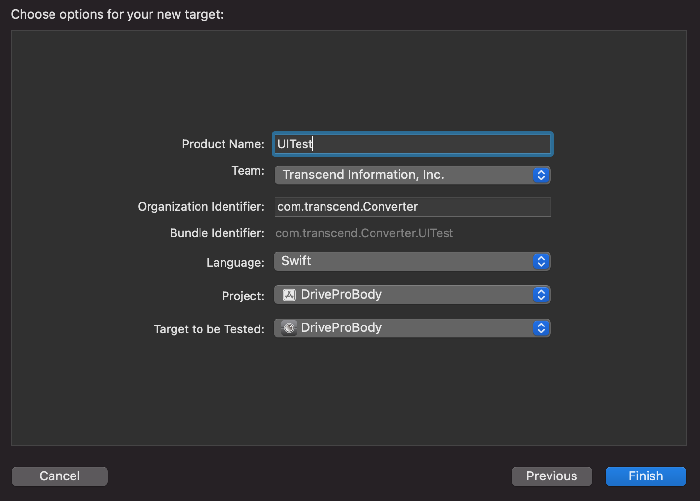
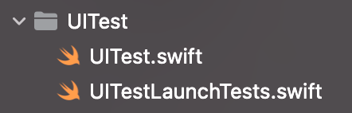
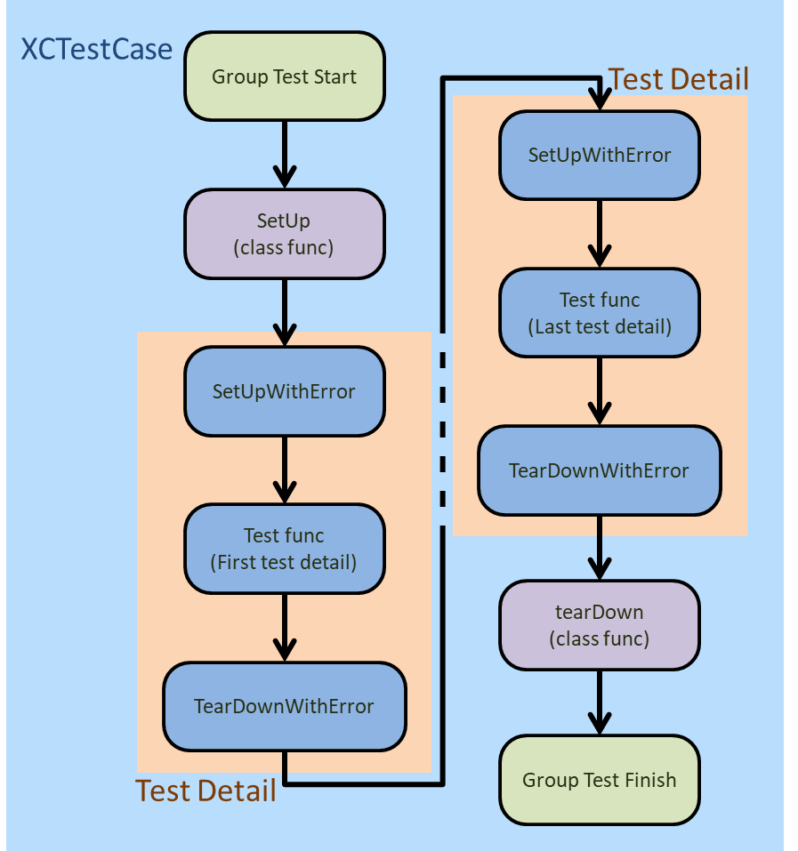
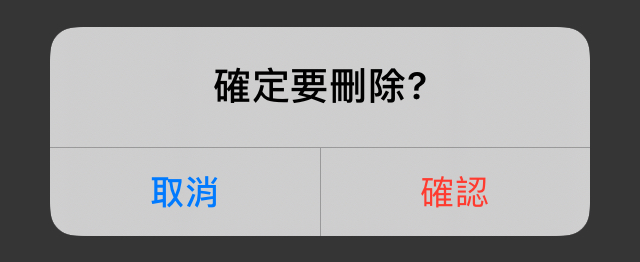
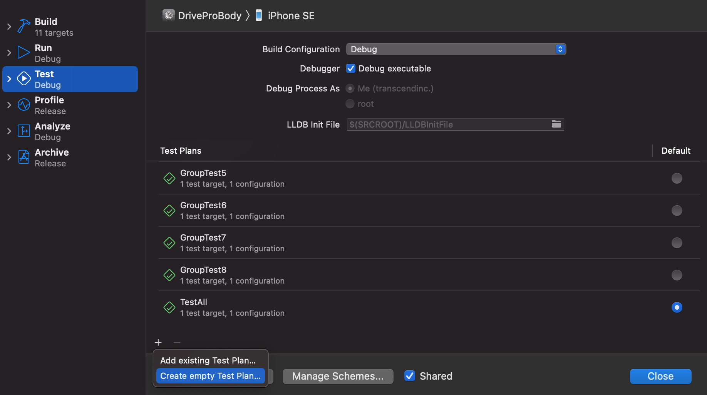
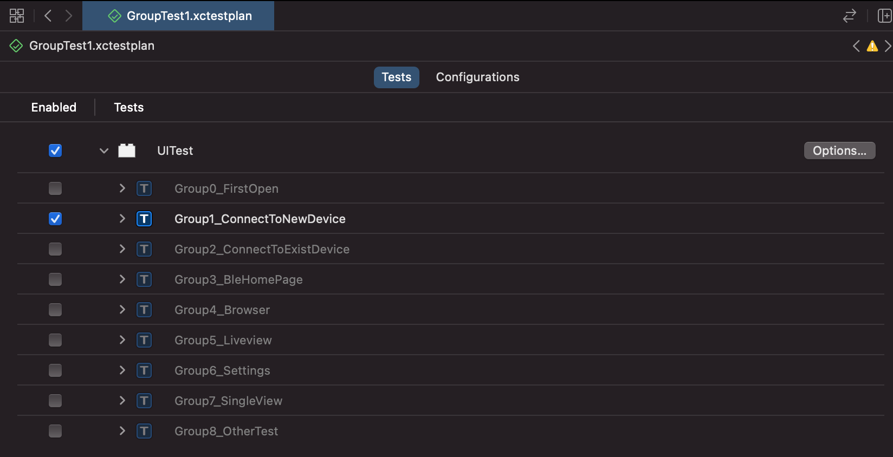

# 使用XCTest撰寫自動化測試&一些測試技巧

## 前言

XCTest為Xcode內建的UI測試工具，無須安裝任何第三方套件(Pod,Swift Package)即可使用。

## 專案設置
1. 於專案的`xcodeproj`->`General`->`Targets`點選下方 *`+`* 新增一個Target。
    
    

1. 選擇`iOS`->`Test`->`UI Testing Bundle`，並點選`Next`做下一步的設定。 
    
    

1. 設定Target名稱、Bundle ID與要測試的專案
    
    

1. 完成後專案內會新增兩個檔案，裡面有一些測試範例和註解，內容主要是做啟動測試和啟動畫面截圖，若不需要可以直接刪除重新新增檔案。

    

## 測試架構與流程

一個測試專案底下可以有多個測試群組(XCTestCase)，而一個測試群組內可以有多個測試細項(Function)，以下依序作介紹。

### 測試架構

測試群組的程式架構如下：
```
clase Group1_FirstTestGroup: XCTestCase {
    override clase func setup(){
        //群組測試開始
    }

    override func setUpWithError() throws {
        //細項測試開始
    }

    override func tearDownWithError() throws {
        //細項測試結束
    }

    override class func tearDown(){
        //群組測試結束
    }

    //撰寫測試細項(function)
    func test1_Function() throws{
        //測試細項1
    }
}
```
說明:
1. 群組名稱：即「物件名稱」，以上述程式碼為例，群組名稱為「`Group1_FirstTestGroup`」，群組的測試順序由此名稱決定
1. 測試細項：其Function名稱必須以「`test`」為開頭，測試順序也是由此名稱決定

### 測試流程

測試流程圖如下:



- SetUp、TearDown(Class Function)：用於整個群組測試的開始與結束，可在此執行群組測試中僅須執行一次的行為，例如：測試所需的資料讀取(SetUp)與儲存(TearDown)。
- SetUpWithError、TearDownWithError：於每個測試細項執行前後執行，可在此執行重複性的操作，例如：每次測試前須回到某畫面或測試完成後回到首頁。
- Test Function：測試的所有操作細節，依照目的的不同撰寫不同的功能，可依照想測試的畫面中，元件的數量來做規劃，基本的思維邏輯是`UI事件觸發後，確認UI是否符合預期的改變`，也就是[**UI操作**](#UI操作)->[**UI讀取**](#UI讀取)的循環。

## 開發技巧

依照開我的發經驗分為三類整理：模擬使用者操作([UI操作](#UI操作))、確認操作後的畫面([UI讀取](#UI讀取))、重複性程式與錯誤處裡([其他](#其他))。

<h3 id = "UI操作">UI操作</h3>

1. 開啟APP

    測試的首要步驟就是開啟要測試的APP，也可以將APP退到背景與喚醒，除此之外，部分APP需要進入手機的設定頁面調整WiFi或藍芽也是使用相同的方法，透過輸入Bundle Id來開啟指定的APP，而大部分的系統提示無法被專案讀取到，也是透過特定的Bundle ID來讀取。
    ```
    //開啟目標專案的APP
    XCUIApplication().launch()

    //將APP退到背景
    XCUIApplication().terminate()

    //將APP從背景喚醒
    XCUIApplication().activate()

    //開啟手機的設定
    XCUIApplication(bundleIdentifer:"com.apple.Preferences").launch()

    //讀取手機狀態列(訊號強度、手機電量、網路訊號)與系統提示
    XCUIApplication(bundleIdentifer:"com.apple.springboard")
    ```
1. 點擊操作(tap)

    這是最常見的一種UI操作方式，無論是按鈕、開關、Cell等，大部分的UI元件(`XCUIElement`)都適用，而點擊操作並非只能辦到單純的點擊，也可以依照點擊的次數與手指的數量來達成複雜的操作模式，以下用專案APP中讀取到的第一個按鈕為例。
    ```
    let btn = XCUIApplication().buttons.firstMatch
    
    //點一下
    btn.tap()

    //點兩下
    btn.doubleTap()

    //兩指點一下
    btn.twoFingerTap()

    //三指點五下(可依照需求修改)
    btn.tap(withNumberOfTaps:5, numberOfTouches:3)
    ```

1. 長按與拖曳(press)

    長按與拖曳較為相似，多半用在顯示更多功能或移動元件，以下用table view的第一個cell為例。
    ```
    let firstCell = XCUIApplication().tables.cells.firstMatch

    //長按五秒
    firstCell.press(forDuration:5)

    //長按三秒後拖曳至最後一個Cell
    if let lastCell = XCUIApplication().tables.cells.allElementsBoundByIndex.last{
        firstCell.press(forDuration:3, thenDragTo:lastCell)
    }
    
    //長按兩秒後快速拖曳至最後一個Cell並懸停一秒
    if let lastCell = XCUIApplication().tables.cells.allElementsBoundByIndex.last{
        firstCell.press(forDuration:2, thenDragTo:lastCell, withVelocity:.fast, thenHoldForDuration:1)
    }
    ```
1. 滑動(swipe)

    上下左右滑動，皆可指定滑動的速度(velocity)，以下用Collection View為例。

    ```
    let collectionView = XCUIApplication().collectionViews.firstMatch

    //上滑
    collectionView.swipeUp()

    //下滑
    collectionView.swipeDown()

    //快速左滑
    collectionView.swipeLeft(velocity: .fast)

    //慢速右滑
    collectionView.swipeRight(velocity: .slow)
    ```

1. 縮放(zoom)與旋轉(rotate)

    兩指的相關操作，透過兩指距離來縮放、相對位置角度來旋轉，以下用map view為例。

    ```
    let mapView = XCUIApplication().maps.firstMatch

    //放大一倍
    mapView.pinch(withScale: 2, velocity:1)

    //順時針轉90度，每秒轉30度
    mapView.rotate(CGFloat.pi / 180 * 90, CGFloat.pi / 180 * 30)
    ```

<h3 id = "UI讀取">UI讀取</h3>

1. 使用順序取得指定的UI元件(allElementsBoundByIndex)

    首先，要先了解螢幕讀取(Screen reader)的運作模式，簡言之，螢幕讀取是以螢幕的左上角為起點先由左至右，再由上至下依序讀取畫面上的元件，以此順序給予UI元件編號，透過編號即可取得元件，此方法可以快速地取得簡單的UI元件，例如：提示框(Alert)上的按鈕，可以快速地針對詢問式的UI進行測試。
    
    
    
    ```
    //取得提示框上的按鈕
    let btns = XCUIApplication().alerts.firstMatch.buttons
    
    //點選提示框上的第一個按鈕(取消)
    btns.allElementsBoundByIndex[0].tap()
    //點選提示框上的第二個按鈕(刪除)
    btns.allElementsBoundByIndex[1].tap()
    ```

1. 使用字串(AccessibilityID／AccessibilityLabel)取得指定元件

    若是要測試較為複雜的UI布局，無法很直接的知道按鈕的數量，則需要透過給予指定的名稱來取得元件，可透過AccessibilityID或AccessibilityLabel來設定名稱。

    - AccessibilityID(推薦)：純粹使用於UI測試，使測試程式透過此字串讀取到此元件。
    - AccessibilityLabel：用於無障礙使用的螢幕閱讀，預設與元件內顯示的文字(title)相同，開啟iPhone的Voice Over則會使用此字串作為播報此元件的提示，若要使用此字串作為UI測試使用，須注意多國語系問題。

    ```
    //點擊登入按鈕
    XCUIApplication().alerts.firstMatch.buttons["登入"].tap()
    ```

<h3 id = "其他">其他</h3>

1. 常用變數與函式宣告
    
    由於所有的測試群組都是繼承於XCTestCase，因此可以透過`Extension`將重複性的代碼整理出來，方便不同測試群組使用，也可以透過`static`達到跨群組共用測試變數的功能。
    
    ```
    extension XCTestCase {
        //整理出常用的app並統一宣告在extension內
        var myApp : XCUIApplication {
            return XCUIApplication()
        }
    
        var settingsApp : XCUIApplication{
            return XCUIApplication(bundleIdentifier:"com.apple.Preferences")
        }

        //常用的函式，如點選提示框、開啟/關閉WiFi
        func systemAlertSelect(by index:Int) -> Bool{
            var index = index
            //判斷是否有系統提示
            let springboard = XCUIApplication(bundleIdentifier:"com.apple.springboard")
            if springboard.buttons.count > 1{
                //判斷左上角是否有返回前一個APP的按鈕，如果有則index需+1
                if springboard.buttons.allElementsBoundByIndex.contains(where: {$0.identifier == "breadcrumb"}){
                    index += 1
                }
                
                if springboard.buttons.element(boundBy: index).isHittable{
                    springboard.buttons.element(boundBy: index).tap()
                    return true
                }
            }else if myApp.alerts.count > 0{
                //非系統提示，直接透過APP讀取提示框
                let buttons = myApp.alerts.buttons
                if buttons.count > index{
                    buttons.allElementsBoundByIndex[index].tap()
                    return true
                }
            }
            return false
        }
        
        func systemWifiOn(_ isTurnOn:Bool){
            //進入設定點擊WiFi開關
            settingsApp.launch()
            settingsApp.tables.cells.staticTexts["Wi-Fi"].tap()
            sleep(1)
            let wifiSwitch = settingsApp.tables.cells.firstMatch.switches.firstMatch
            
            if let value = wifiSwitch.value as? String,
            Int(value) == (isTurnOn ? 0 : 1){
                wifiSwitch.tap()
            }
            
            sleep(isTurnOn ? 2 : 0)
        }
    }
    ```

1. 等待某條件成立

    測試時多半會需要等待某條件出現才可以執行下一步，否則測試失敗，可使用在大部分的UI動畫效果上，確認動畫執行完的結果是否符合預期。

    ```
        func waitFor(object: XCUIElement,
                    timeout: TimeInterval = 20,
                    file: String = #file,
                    line: UInt = #line,
                    message:String = "",
                    errorCode: Error = XCTestCase.defaultError,
                    debugBlock:((XCTWaiter.Result)->())? = nil,
                    expectationPredicate: @escaping (XCUIElement) -> Bool) throws {
            //設定使用closure設定判斷標準
            let predicate = NSPredicate { obj, _ in
                expectationPredicate(obj as! XCUIElement)
            }
            //綁定測試物件與判斷標準
            let expectation = XCTNSPredicateExpectation(predicate: predicate, object: object)
            
            //等待判斷結果
            let result = XCTWaiter().wait(for: [expectation], timeout: timeout)
            
            //無論成功失敗，在此函式執行完後執行Debug用的Closure
            defer {
                if let block = debugBlock{
                    block(result)
                }
            }
            
            //判斷執行結果，若失敗則丟出錯誤代碼
            guard result == .completed else {
                NSLog("%@ of predicate fail", object.description)
                throw errorCode
            }
        }
    ```

1. 檢查元件是否存在或消失

    利用上述等待條件的函示，即可處理元件存在與否的相關問題。

    ```
        func uiElementExists(for element: XCUIElement,
                            timeout: TimeInterval = 20,
                            errorCode: Error = XCTestCase.defaultError) throws {
            try waitFor(object: element,
                        timeout: timeout,
                        errorCode: errorCode,
                        debugBlock: { result in
                            if result != .completed{
                                NSLog("Wait for %@ appear fail",element.self)
                            }
                        },
                        expectationPredicate: { $0.exists })
        }
        
        func uiElementDisappear(for element: XCUIElement,
                                timeout: TimeInterval = 20,
                                errorCode: Error = XCTestCase.defaultError) throws{
            try waitFor(object: element,
                        timeout: timeout,
                        errorCode: errorCode,
                        debugBlock: { result in
                            if result != .completed{
                                NSLog("Wait for %@ disappear fail",element.self)
                            }
                        },
                        expectationPredicate: { !$0.exists })
        }
    ```

1. 檢查畫面使否有在變化

    利用截圖的方式比較兩張圖片是否相同，多半用在測試影片播放、影像串流、動畫效果等。
    
    ```
    func checkVideoIsPlaying() throws {
        let playView = myApp.collectionViews["videoView_collectionView"].cells.firstMatch
        let timeSlider = myApp.sliders["videoView_timeSlider"]
        try waitFor(object: timeSlider,timeout: 30, errorCode: PlayerError.BufferTimeout) { $0.value as? String != "0%" }
        let firstImage = playView.screenshot().image.pngData()
        sleep(3)
        let secImage = playView.screenshot().image.pngData()
        
        if firstImage == secImage{
            throw PlayerError.NotPlay
        }
    }
    
    func checkVideoIsPause() throws {
        let playView = myApp.collectionViews["videoView_collectionView"].cells.firstMatch
        let timeSlider = myApp.sliders["videoView_timeSlider"]
        
        if timeSlider.exists{
            playView.tap()
        }
        sleep(1)
        let image1 = playView.screenshot().image
        sleep(3)
        let image2 = playView.screenshot().image
        
        if image1.pngData() != image2.pngData(){
            throw PlayerError.NotPause
        }
    }
    ```

1. 輸出錯誤訊息

    為了使UI測試可以很直觀的丟出問題，可以列舉出可能發生的問題因應不同的情況丟出不同的錯誤訊息。

    ```
    enum StatusError : Error {
        case ButtonStatusError
        case SwitchStatusError
    }

    enum CommonError : Error {
        case ElementNotFound
        case NoValue
        case ElementCanNotBeTap
    }

    enum PlayerError : Error {
        case NoBuffer
        case BufferTimeout
        case NotPlay
        case NotPause
        
        case ZoomingFail
    }
    ```

## 測試計畫

寫UI測式的主要目的除了TDD之外，多半會應用於CI/CD上，於上架前執行測式以確保改動不影響UI操作，若要測試的APP除了軟體上的操作外，還需要硬體配合，就會對UI測試的結果添加了相當大的變數，舉例來說，若測試執行到一半，硬體因電量不足而關機，導致測試結果失敗。當測試項目日益增多時，若因一些外在因素導致測試結果無法使用，而跑測試的時間又曠日廢時，則可以使用`測試計畫`將測試內容做分割，執行CI/CD時，也可以依照不同的job給予不同的測試計畫，避免單一任務攏長的問題。

### 建立測試計畫

進入Edit Scheme畫面(`Product`->`Scheme`->`Edit Scheme...`)，選擇`Test`標籤，可以看到測試計畫(Test Plans)的項目，點選下方的`+`可新增空的計畫。



測試計畫內可自行勾選要執行的測試程式與測試的相關設定(語言、地區等)



### 使用Fastlane與yml執行單一測試計畫

在yml內新增一個測試的job，可使用繼承的方式，把重複的設定集中在一起，最後透過`fastlane`的`scan`工具，指定測試計畫與要測試的裝置ID，即可針對單一測試計畫進行測試，詳情可參考Fastlane和GitLav_CI的介紹。

    #建立一個可繼承的job
    .test_job: &test_definition
      variables:
        GIT_STRATEGY: none

      only:
        - merge_requests
        - web
      
      #上傳測試報告
      artifacts:
        reports:
          junit: fastlane/test_output/report.junit
    
      retry: 2

      tags:
        - ios

    #測試的job
    test_project_new_device:
      <<: *test_definition
      stage: test
      script:
      - fastlane run scan testplan:"GroupTest0" destination:"platform=iOS,id=$TEST_DEVICE_ID"


##### 有關UI測試的粗略介紹大概就是這樣，前陣子太忙了實在沒時間寫文件，結果一回神，累積的速度實在是讓我嚇一跳，只好慢慢填坑了。Orz