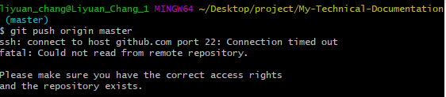
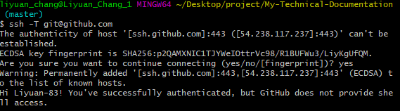

# Gitlab或Github遇到Port 22:Connection time out

## 前言

某天在上Code的時候遇到下面這樣的錯誤訊息



看起來是GitHub和GitLab為了提高安全性，將SSH用的Port 22擋下來了

## 解法

Gitlab與Github在解法上基本相同，基本原理就是新增SSH設定，更換hostname和預設的Port 22

1. 在`~/.ssh`資料夾內新增一個`config`檔，此檔案會在SSH做訪問時，依照訪問的IP做不同的設定。

2. 在`config`檔內新增以下設定

    - GitHub:
    ```
    Host github.com
        Hostname ssh.github.com
        Port 443
    ```

    - GitLab:
    ```
    Host gitlab.com
        Hostname altssh.gitlab.com
        User LiYuan83 #記得改成自己的gitlab名稱
        Port 443
        PreferredAuthentications publickey
        IdentityFile ~/.ssh/id_rsa
    ```

3. 完成後執行以下程式測試結果

    - GitHub:
    ```
    $ ssh -T git@github.com
    ```
    - GitLab:
    ```
    $ ssh -T git@gitlab.com
    ```

    會出現「Are you sure you want to continue connecting (yes/no/[fingerprint])?」，輸入`yes`後繼續連線。

4. 若設定成功，即可看到通過驗證的訊息。

    

## SSH IP設定參考文件

[GitHub SSH Hostname Setting](https://docs.github.com/en/authentication/troubleshooting-ssh/using-ssh-over-the-https-port#enabling-ssh-connections-over-https)

[GitLab SSH Hostname Setting](https://docs.gitlab.com/ee/user/gitlab_com/#alternative-ssh-port)